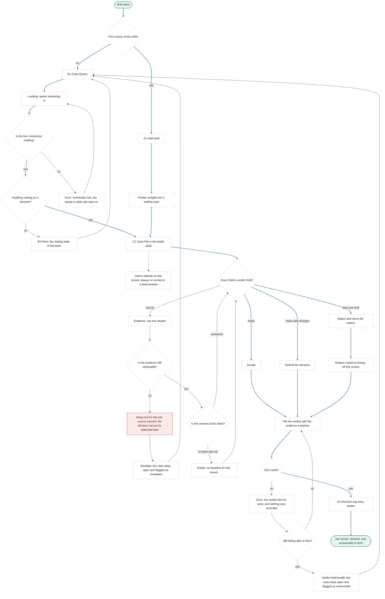
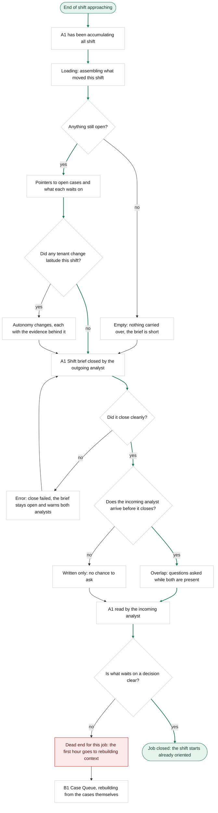
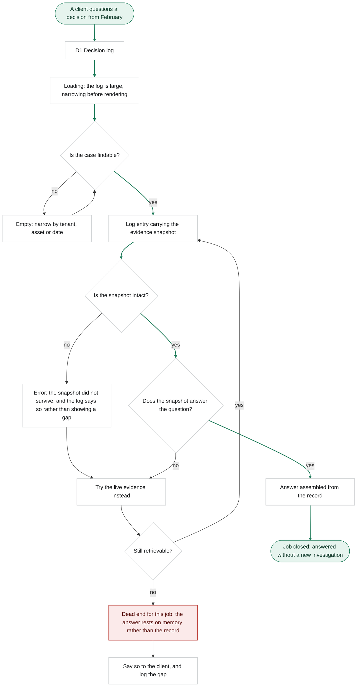

# Harrier: user flows

Stage 03a, Step 4, revised at Step 6 after critique on two instruments.

**Declared substitution, third time this stage.** The pack traces flows onto To-Be phases and takes decision points from As-Is barriers. Both CJM files are out of track, so the skeleton comes from `jtbd.md` and the decision points from pains recorded in `personas.md`, which are practitioner quotes rather than phases. **These flows are the document that step-screens trace to in the matrix.**

**Colour is semantic.** Green marks the two ends of the happy path and the arrows along it. Red marks a dead end **for the job**: the job cannot close from there. Grey is everything between, including errors and empty states that recover. Tokens are the light ones from `research/_page.css`.

**What critique #1 changed here.** Every red node now has a way out. It stays red because the job still fails, but the person is no longer stranded: the prose already promised an escalation the diagram did not have, and that contradiction was the finding. Errors were added where only a happy path existed, including the one that matters most in a product built on an append-only log: a verdict that does not write.

**These diagrams are versioned as text.** An exported image tells git that a file changed; the text tells it what changed in the route.

---

## Main job: decide whether Clerk's verdict holds

> When Clerk hands me a case it has already investigated, I want to decide whether its verdict holds, so that the decision is made and I can still defend it months later.

**Activation node: `File`.** From `aarrr.md`: the analyst rules on a Clerk-assembled case, with the evidence in view, and files it. It is a named node rather than something implied.

**Distance from the start: two screens.** Queue, then Case File. The limit is three, so the route does not defer first value further than the research promised.

**The element that carries the differentiator is in the diagram, and it is attached rather than traversed.** `Autonomy` hangs off `Case` on a dotted link, because Clerk's latitude on this tenant is a fixed-position element that is always on screen, not a step somebody walks through. Critique #1 found it missing from every route; critique #2 found that drawing it in the chain contradicted the navigation model, which calls it global and always visible. Both corrections are in.

**Decisions.** Is this the first screen of the shift. Is the live connection holding. Is anything waiting on a decision. Does Clerk's verdict hold. Is the evidence still retrievable. Is this normal at this client. Did the verdict write.

**States.** `Loading` while the queue streams. `Error` when the live connection drops, where the queue must say it is stale rather than look healthy and lie. `Empty` when nothing waits, in which case the fleet fills the pane rather than a blank. `Empty` again when a tenant has no baseline yet, which is real for a newly onboarded client. `Error` when the verdict does not write, which in a product built on an append-only log is not an inconvenience, **and it has a floor**: after a retry still fails, the verdict is held locally and the case stays open flagged as unrecorded rather than looping forever. Critique #2 caught that the first fix for dead ends had itself created an unbounded retry loop on the most critical operation in the product.

**One dead end, and it now has a way out.** If the source has aged out the job cannot close, because the decision will not be defensible in April. The analyst escalates and the case **stays open, flagged as escalated**, then returns to the queue. The node stays red because the job failed, not because the person is stuck.

**And the exit created a requirement.** Critique #2 found it: an escalated case has to carry a state that exists nowhere. `escalated` is now a named value of `Case.status` in the entity inventory, and the queue has to show it, because a case that left the analyst's hands and looks identical to one that did not is worse than no escalation at all.

**All three verdicts are green.** Accept, amend and reject all lead to `Win`. This is design principle 3 rendered rather than asserted: rejecting Clerk is a first-class outcome, not a fallback. A flow that painted only `Accept` as the happy path would be arguing against its own product.

**R3 has no separate flow, on purpose.** Teaching the agent lives on `Reject` and `Route`. The rest of that job leaves the analyst's screen entirely and lands on a detection engineer, who is not a user here.

---

## R1: pick up and hand off a shift

> When I take over a rotation somebody else was working, I want to know what changed and what is waiting on a decision, so that I do not spend my first hour rebuilding what the last shift already knew.

**The first node carries the correction from stage 02.** The brief has been accumulating all shift; it is not written at the end. The interviewed responders put the failure mode exactly at the end of the shift, and one of them had already solved it by letting the notes accumulate through the day.

**Decisions.** Is anything still open. Did any tenant change latitude. Did the brief close cleanly. Does the incoming analyst overlap with the outgoing one. Is what waits on a decision clear.

**States.** `Loading` while the brief assembles what moved. `Empty` when nothing carries over, which is a good outcome and must not look like a broken screen. `Error` when the close fails, where the brief stays open and warns **both** analysts rather than one. `Written only` when there is no overlap, which is the common case: 73% of organisations allow remote work at least some of the time, and the responders working remotely described the written handover permanently replacing the verbal one.

**Why the dead end is red, and where it now leads.** The goal of this job is to not spend the first hour rebuilding. Once the hour is spent it cannot be unspent, so the job failed. The analyst still has somewhere to go: the queue, rebuilding from the cases themselves, which is exactly the expensive path the job existed to avoid.

---

## R2: answer for a decision made months ago

> When a client or an auditor questions a decision made months ago, I want to show what was known at the time, so that the answer comes from the record instead of my memory.

**Decisions.** Is the case findable. Is the snapshot intact. Does the snapshot answer the question. Is the live evidence still retrievable.

**States.** `Loading` before rendering, because the log is large. `Empty` on a search that returns nothing, recovering by narrowing on tenant, asset or date. `Error` when the snapshot itself did not survive, which is a different failure from the source having aged out, and the log has to **say so** rather than render a gap that looks like an answer.

**The dead end now ends in an action rather than in silence.** Saying so to the client and logging the gap is not the job closing; it is the honest version of failing it, and the gap becomes data about how well the record is holding.

**The same dead end appears in this flow and in the main one**, and that is the point. Both routes fail at the same place: evidence that no longer exists. The business outcome in `research.md` is the share of client escalations where the original evidence answered the question without new investigation, and this is the node that decides it.

---

## What the flows did not change, and one debt they record

**No new screens appeared.** Every screen node already exists in the concept sitemap: A1, B1, B2, C1, D1. `Pointer`, `Overlap`, `Esc`, `Own` and `Route` are steps or events rather than screens, and `Route` deliberately leaves the product.

**Recorded debt, found by the second instrument.** E1, F1 and F2 have no flows, because drawing a route for a deferred screen implies it is being built. The consequence is real and is written down here rather than left implicit: **when those screens come off the backlog they will arrive with no empty, error or loading states defined**, and whichever stage picks them up owes that work before drawing them.
