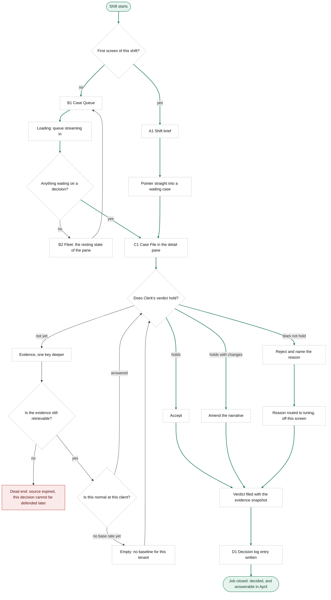
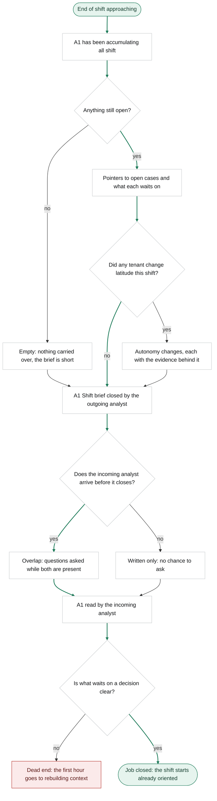
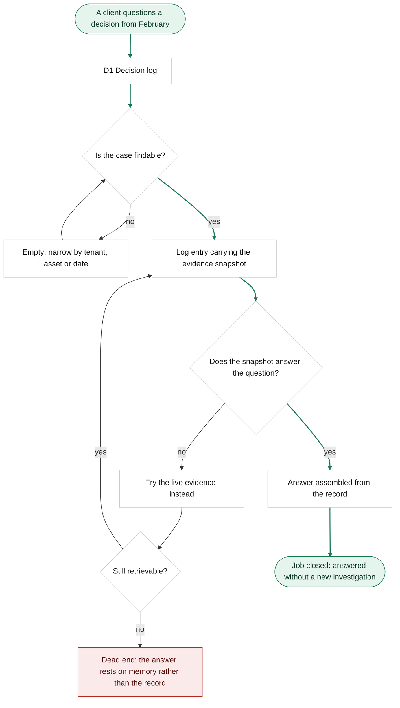

# Harrier: user flows

Stage 03a, Step 4. Routes for the primary persona through the main job and two related ones.

**Declared substitution, third time.** The pack traces flows onto To-Be phases and takes decision points from As-Is barriers. Both CJM files are out of track, so the skeleton comes from `jtbd.md` and the decision points from the pains recorded in `personas.md`, which are quotes from practitioners rather than phases. **These flows are therefore the document that step-screens trace to in the matrix at Step 5.**

**Colour is semantic, not decorative.** Green marks the two ends of the happy path and the arrows along it. Red marks a genuine dead end, a node with no route left to the goal. Grey is everything between, including errors and empty states that recover back into the flow. Tokens are the light ones from `research/_page.css`, not the dark example in the pack.

**These diagrams are versioned as text.** An exported image would tell git that a file changed; the text tells it what changed in the route.

---

## Main job: decide whether Clerk's verdict holds

> When Clerk hands me a case it has already investigated, I want to decide whether its verdict holds, so that the decision is made and I can still defend it months later.

**Activation node: `Filed`.** From `aarrr.md`: the analyst rules on a Clerk-assembled case, with the evidence in view, and files it. It is a named node above rather than something implied.

**Distance from the start: two screens.** Queue, then Case File. The limit is three, so the route does not defer first value further than the research promised.

**Decisions.** Is this the first screen of the shift. Is anything waiting on a decision. Does Clerk's verdict hold. Is the evidence still retrievable. Is this normal at this client.

**States.** `Loading` while the queue streams. `Empty` when nothing waits, in which case the fleet fills the pane rather than a blank. `Empty` again when a tenant has no baseline yet, which is a real case for a newly onboarded client and recovers back into the decision.

**The dead end is deliberate and it is only one.** If the underlying source has aged out, the analyst can still escalate, but the job as written cannot close: the decision will not be defensible in April. Everything else in this diagram recovers.

**All three verdicts are green.** Accept, amend and reject all lead to `Win`, and the highlighted arrows say so. This is design principle 3 rendered in a diagram: rejecting Clerk is a first-class outcome, not a fallback path. A flow that painted only `Accept` as the happy path would be arguing against the product.

**R3 has no separate flow, on purpose.** Teaching the agent lives on the `Reject` and `Route` nodes above. The rest of that job leaves the analyst's screen entirely and lands on a detection engineer, who is not a user of this product. Drawing a flow for it would be drawing somebody else's product.

---

## R1: pick up and hand off a shift

> When I take over a rotation somebody else was working, I want to know what changed and what is waiting on a decision, so that I do not spend my first hour rebuilding what the last shift already knew.

**The first node carries the correction from stage 02.** The brief has been accumulating all shift; it is not written at the end. The interviewed responders put the failure mode exactly at the end of the shift, and one of them had already solved it by letting the notes accumulate through the day.

**Decisions.** Is anything still open. Did any tenant change latitude. Does the incoming analyst overlap with the outgoing one. Is what waits on a decision clear.

**States.** `Empty` when nothing carries over, which is a good outcome and should not look like a broken screen. `Written only` when there is no overlap, which is the common case: 73% of organisations allow remote work at least some of the time, and the interviewed responders working remotely described the written handover permanently replacing the verbal one.

**Why the dead end is red rather than grey.** The goal of this job is not to spend the first hour rebuilding. Once the hour is spent it cannot be unspent, so there is no route back to the goal. The analyst still works; the job still failed.

---

## R2: answer for a decision made months ago

> When a client or an auditor questions a decision made months ago, I want to show what was known at the time, so that the answer comes from the record instead of my memory.

**Decisions.** Is the case findable. Does the snapshot answer the question. Is the live evidence still retrievable.

**States.** `Empty` on a search that returns nothing, which recovers by narrowing on tenant, asset or date.

**The same dead end appears twice, in this flow and in the main one**, and that is the point. Both routes fail at the same place: evidence that no longer exists. The business outcome in `research.md` is the share of client escalations where the original evidence answered the question without new investigation, and this is the node that decides it.

---

## What the flows did not change

**No new screens appeared.** Every node that is a screen already exists in the concept sitemap: A1, B1, B2, C1, D1. `Pointer`, `Overlap` and `Route` are steps or events rather than screens, and `Route` deliberately leaves the product.

**R4 has no flow** because it is scoped LATER, and drawing a route for a deferred screen would imply it is being built.
